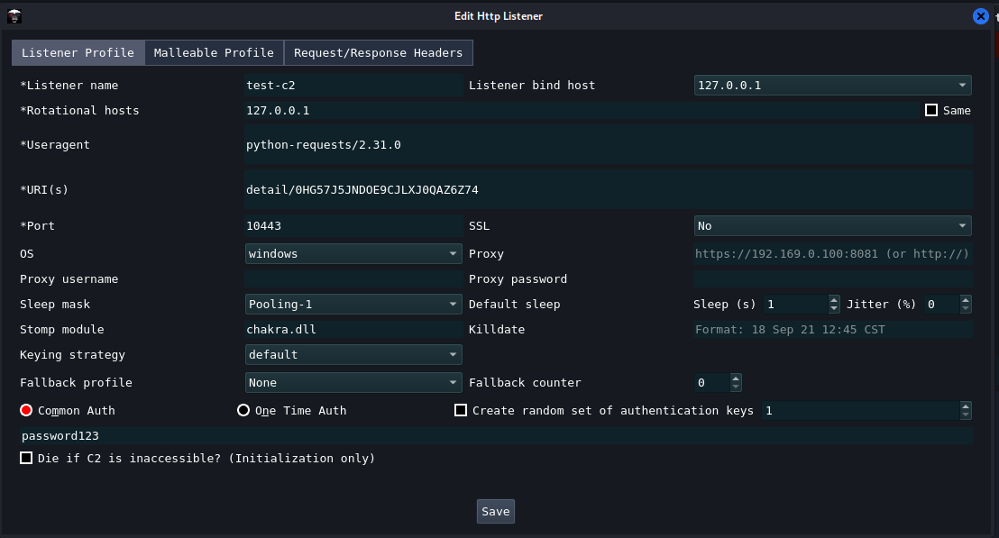
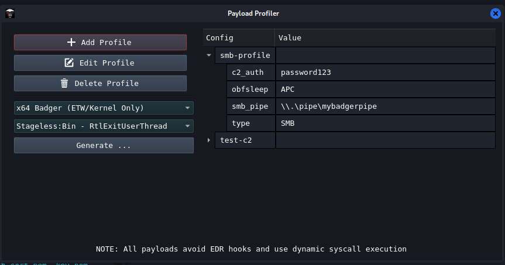
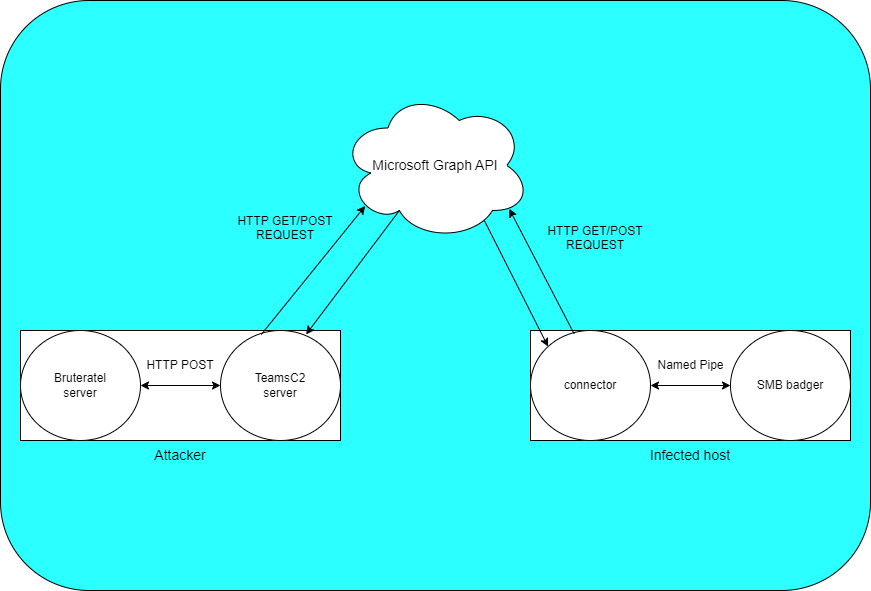

# External-C2-Teams
The core logic behind using an External C2 is to hide your implant output inside legitimate network traffic. This is precisely the purpose for which Teams C2 was designed - to assist operators in blending seamlessly into legitimate network traffic.

## Azure Infrastructure Setup
1. Create Azure Tenant
2. Make sure that you purchase 2x Office 365 E3 Developer License (Trial version doesn't support Teams anymore)
3. Create two users in the azure tenant. One used for the server and one for the connector. They must be Global Administrators.
4. Make sure that each user has "Usage Location" set to United Kingdom in the "User Properties"
5. Make sure that each user has "Office 365 E3 Developer" license assigned and only enabled the following services for this license: "Microsoft Teams", "Common Data Service for Teams" and "Microsoft 365 Apps for Enterprise"
6. Go to App registrations tab and create new registration for the server and for the connector. Just name them "External-C2-Server" and "External-C2-Connector" with the default settings.
7. For each app you need to generate a new secret and make sure to save the secret and the client-id.
8. Go to "API permissions" tab in the registered apps and please add new permissions. You need to select Microsoft Graph->Delegated Permissions and set the following:
- Chat.ManagedDeletion.All
- Chat.Read
- Chat.ReadWrite
- ChatMessage.Send
- Directory.ReadWrite.All
- Group.ReadWrite.All
- TeamMember.ReadWrite.All
9. Now go to "Owners" tab for each app and for the connector app select the user that you created for connector and for the server app set the user created for the server.
10. In the python3 server you need to update the `username`, `password`, `tenant-id`, `client-id` (From App registration), `target_user_id` (The connector account object-id) and the `server_url` pointing to bruteratel. You will need to do the same for the connector in `Config.h` .

(Note: Before trying out the python3 server and the connector. Please log into the [https://developer.microsoft.com/en-us/graph/graph-explorer]() with the accounts and check if you can properly authenticate and query the graph APIs. Also, sometimes the changes made in azure portal take a while to sync properly.)

## Bruteratel Listener Setup

## Things You Shouldn't Do
1. Don't start the connector without starting the TeamC2 server first.
2. Don't try to change the listener HTTP headers and responses.
3. Keep in mind that when executing a command such as `upload`, `download`, `sharpinline`, `sharpreflect` or any other command that requires sending the payload over HTTP, you should first check the size of the file because if you try to send files larger then 5MB then this can take from 1 to more hours and you will completely block I/O until everything gets send. Please do not try to speed up this process by setting `sleep 1` because you will often hit rate-limiting issues causing even more delays. My best advise is to use anywhere between `3` and `10` for sleep.

### Architecture Diagram

